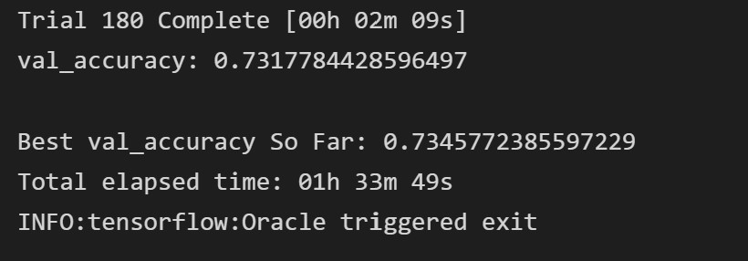

# Deep-Learning-Challenge

## Overview
For this analysis, we look at a data set from a non-profit organization which records past records of different ventures they have funded. The below shows what data is included in the data set. The purpose for this analysis is to use deep learning to train and test this data set and see if it can make an accurate prediction on whether or not the venture is successful.

- EIN and NAME—Identification columns
- APPLICATION_TYPE—Alphabet Soup application type
- AFFILIATION—Affiliated sector of industry
- CLASSIFICATION—Government organization classification
- USE_CASE—Use case for funding
- ORGANIZATION—Organization type
- STATUS—Active status
- INCOME_AMT—Income classification
- SPECIAL_CONSIDERATIONS—Special consideration for application
- ASK_AMT—Funding amount requested
- IS_SUCCESSFUL—Was the money used effectively

## Steps
- In order to use this data for deep learning, some data processing was performed first. The target for this anaylsis is the IS_SUCCESSFUL. The EIN and NAME columns are considered neither a target or feature so these 2 columns were dropped. The rest of the columns were kept as features that will be use for the model.
- As for creating the model, the first model created had an accuracy of a little under 75% so I tried to optimize the model by doing some small changes. I binned more datas, changed the amount of neurons, and add more layers. I change from 2 hidden layers to 3 and used 94 neurons for the first layer and 47 for the second and third layers. After rerunning the models serval times, it stay around 72%-73% which is about the same as the first model created. Lastly I used a Keras tuner to optimize the model and see if it can reach 75% accuracy.

## Conclusion
<!------>

In the end, using the Keras tuner still did not reach the target goal of 75% accuracy. The accuracy 
